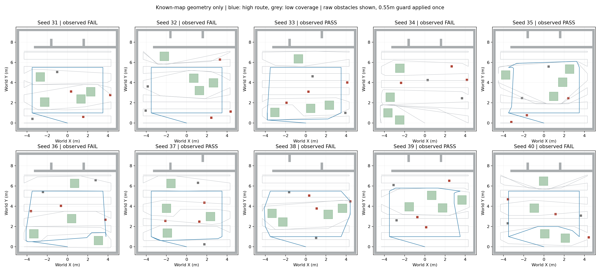

# 当前高位与低位路线几何预筛

范围：冻结31–40布局，准确静态地图假设、树冠近似、固定姿态、恒速与转弯惩罚。不是ROS/Gazebo或检测器，也不是整场Gate。
55cm为已膨胀鲁棒设计包络，默认额外膨胀0；导航用全高柱，视线遮挡仍用物体高度。目标坐标只在路线生成后用于几何可见性评估。

本次导入来源均为高位实跑。每个seed两行复用同一来源Gate，low_coverage行并不表示该低位路线被实际飞过。

| seed | 路线 | 几何可行 | 航程m | 全线名义s | 累计三类中心可见s | 累计三类外圈几何可见s | 同源高位实跑Gate |
|---|---|---|---:|---:|---:|---:|---|
| 31 | high | GEOMETRY_FEASIBLE | 26.64 | 37.30 | — | — | FAIL |
| 31 | low_coverage | GEOMETRY_FEASIBLE | 115.64 | 227.73 | 89.60 | 90.40 | FAIL |
| 32 | high | GEOMETRY_FEASIBLE | 26.64 | 37.30 | 19.44 | 20.14 | FAIL |
| 32 | low_coverage | GEOMETRY_FEASIBLE | 116.75 | 229.58 | 168.26 | 175.91 | FAIL |
| 33 | high | GEOMETRY_FEASIBLE | 28.65 | 43.82 | — | — | PASS |
| 33 | low_coverage | GEOMETRY_FEASIBLE | 115.78 | 226.97 | 103.64 | 103.93 | PASS |
| 34 | high | GEOMETRY_UNAVAILABLE | — | — | — | — | FAIL |
| 34 | low_coverage | GEOMETRY_FEASIBLE | 121.64 | 246.73 | 161.03 | 191.32 | FAIL |
| 35 | high | GEOMETRY_FEASIBLE | 27.64 | 44.54 | 11.52 | 12.11 | PASS |
| 35 | low_coverage | GEOMETRY_FEASIBLE | 119.12 | 237.53 | 53.42 | 64.01 | PASS |
| 36 | high | GEOMETRY_FEASIBLE | 28.48 | 46.60 | 34.64 | 36.93 | FAIL |
| 36 | low_coverage | GEOMETRY_FEASIBLE | 116.32 | 230.87 | 94.52 | 117.57 | FAIL |
| 37 | high | GEOMETRY_FEASIBLE | 26.78 | 40.48 | 26.20 | — | PASS |
| 37 | low_coverage | GEOMETRY_FEASIBLE | 115.72 | 228.87 | 106.01 | 134.76 | PASS |
| 38 | high | GEOMETRY_FEASIBLE | 27.39 | 42.23 | 27.36 | — | FAIL |
| 38 | low_coverage | GEOMETRY_FEASIBLE | 117.25 | 227.42 | 110.71 | — | FAIL |
| 39 | high | GEOMETRY_FEASIBLE | 27.22 | 43.03 | 20.88 | — | PASS |
| 39 | low_coverage | GEOMETRY_FEASIBLE | 116.38 | 224.97 | 139.65 | 179.92 | PASS |
| 40 | high | GEOMETRY_FEASIBLE | 27.09 | 40.86 | 33.24 | 33.83 | FAIL |
| 40 | low_coverage | GEOMETRY_FEASIBLE | 116.27 | 229.78 | 120.39 | 121.19 | FAIL |

## 如何解释

两种可见性口径都要求配置的连续可见驻留，按固定10Hz右端采样；转向计时但不累计观测。这只是几何代理，不是high-view Catalog的质量/置信度/类别投票。中心与外圈应分别比较，不能选择更好看的口径宣布任务成功。
表内三类始终为bridge/panzer/red_cross，不是任意最先看到的三个靶。即使三类全部几何可见，也没有模拟低位复访、投递、走廊或降落；整场时间与检测概率输出null。
全高导航柱与真实高度LOS分开，避免高位直穿树投影；二维准确地图A*仍是乐观先验，不能定位实际进度停滞或控制超调。树冠高度1.8m及排除半径AABB是显式近似，可做敏感性评估，不是精确网格重建。
两路线具有不同的代表速度0.8/0.6m/s；本表是当前配置筛选，不是高度的单变量因果比较。要隔离路线收益，应另用相同速度配置。

汇总中各时间中位数只针对该方法达到三类的子集；高位7例与低位10例不是同一分母，不能相除宣称整批节时。名义路线几何与实际避障轨迹/姿态不同，实际PASS但名义路线几何不齐也可能发生。

仅有单seed B100的概率表没有2.6/1.4m精确格点；本入口不调用其legacy概率回退，不把几何可见性包装为P_interrupt。

